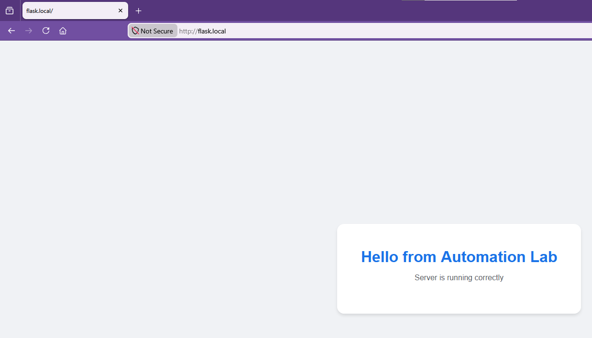
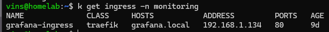
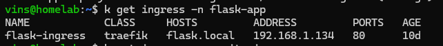
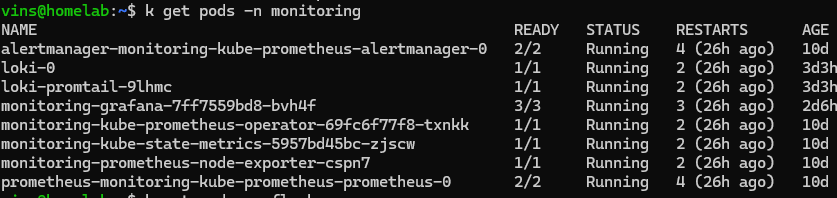
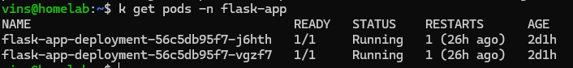

# Monitoring Lab - Kubernetes, Observability and Automation

The main focus was not building a complicated application, but learning the operational side of technologies commonly used in cloud and DevOps environments.

Everything was deployed locally using K3s together with several monitoring and automation tools in order to simulate a small production-like environment. The repository mainly serves as personal documentation and as a future reference to revisit concepts that were explored during the lab.

The project touched several areas related to infrastructure management such as Kubernetes orchestration, ingress traffic, monitoring, probes, rollouts and deployment automation. The idea was gradually building the environment piece by piece and understanding how all the components interact with each other.

---

# Technologies Used

Docker was used to containerize the application and create the images later deployed into Kubernetes. K3s was used as the Kubernetes distribution because of its lightweight setup and simplicity for local environments.

The monitoring stack was based on Prometheus and Grafana, Ansible was later introduced to automate deployment-related tasks and a Makefile was added to simplify repetitive operational commands.

The application itself was built with Flask only to provide a simple workload for the infrastructure environment.

---


# Containerized Application

A very small Flask application was created and containerized using Docker. The application itself is intentionally simple because its only purpose was acting as a workload inside Kubernetes and generating traffic, logs and metrics for the rest of the environment.

This phase mainly helped reinforce Docker-related concepts such as Dockerfiles, image builds, exposed ports and container execution. Despite the application itself was basic, it was enough to later experiment with probes, ingress routing, rollouts and monitoring.

The image was built using:

```bash
docker build -t flask-app .
```

and executed locally using:

```bash
docker run -p 5000:5000 flask-app
```

---

# Kubernetes Deployment

The Flask application was later deployed into a local Kubernetes cluster using K3s. Several Kubernetes resources were configured manually, including namespaces, deployments and services.

This phase was mainly focused on understanding how Kubernetes manages workloads and maintains the desired state of the environment. One of the most important things learned here was realizing that Kubernetes is not simply a container runner, but an orchestration platform constantly monitoring and replacing workloads whenever is necessary.

Most of the work during this stage involved inspecting pods, deployments and services while observing how Kubernetes reacts to changes or failures.

Some of the commands most frequently used during this phase were:

```bash
kubectl get pods -A
kubectl get deployments -A
kubectl get svc -A
kubectl logs <pod-name>
```

---

# Internal Networking

ClusterIP services were configured in order to allow communication between workloads inside the cluster. This part clarified several Kubernetes networking concepts that felt confusing, especially around service discovery and internal DNS resolution.

One important realization during this phase was understanding that Kubernetes services are internal by default unless explicitly exposed externally.

A large part of the experimentation here involved observing how pods communicate with each other and how services abstract pod access behind a stable internal endpoint.

---

# Ingress and Traffic Flow

An NGINX Ingress Controller was deployed in order to expose services externally through local hostnames such as `flask.local` and `grafana.local`.

This part of the project made much more sense of how external traffic actually enters a Kubernetes cluster and how the reverse proxy works.

The `/etc/hosts` file needed manual entries in order to resolve the local domains correctly:

```text
192.168.X.X flask.local
192.168.X.X grafana.local
```

After configuring the ingress rules correctly, the services became accessible directly through the browser.

Command used to check it:

```bash
kubectl get ingress -A
```

---

# Monitoring Stack

A monitoring stack based on Prometheus and Grafana was deployed inside Kubernetes. The main objective during this phase was understanding how observability works in practice and how infrastructure metrics are collected and visualized.

Prometheus was used to scrape metrics from the cluster and workloads, while Grafana provided dashboards to visualize resource usage and cluster behavior.

Prometheus deployment example:

```bash
helm install prometheus prometheus-community/kube-prometheus-stack \
-n monitoring \
--create-namespace
```

Grafana was accessed through port-forwarding:

```bash
kubectl port-forward svc/prometheus-grafana 3000:80 -n monitoring
```

The Grafana password was retrieved from Kubernetes secrets using:

```bash
kubectl get secret -n monitoring prometheus-grafana \
-o jsonpath="{.data.admin-password}" | base64 -d
```

---


# Health Checks and Self-Healing

A `/health` endpoint was added to the Flask application and connected to Kubernetes liveness and readiness probes.

This phase of the project demonstrated how is the Kubernetes self-healing behavior.

Different failure scenarios were intentionally simulated in order to observe Kubernetes automatically restarting unhealthy containers and removing broken pods from traffic routing.

Example probe configuration:

```yaml
livenessProbe:
  httpGet:
    path: /health
    port: 5000
  initialDelaySeconds: 5
  periodSeconds: 10
```

Commands used during this phase:

```bash
kubectl get pods -n flask-app -w #Watch changes in real time
kubectl describe pod <pod-name> -n flask-app
```


---

# Rolling Updates and Rollbacks

The Flask application was modified and redeployed multiple times in order to observe Kubernetes rollout behavior.

This phase helped clarify how Kubernetes performs gradual updates while minimizing downtime and maintaining service availability. It also demonstrated how orchestration platforms simplify deployments compared to manually managed containers.

Several rollout-related operations were tested, including rollout status inspection, deployment history inspection and rollback execution.

Useful commands:

```bash
kubectl rollout restart deployment flask-app-deployment -n flask-app

kubectl rollout status deployment flask-app-deployment -n flask-app

kubectl rollout history deployment flask-app-deployment -n flask-app

kubectl rollout undo deployment flask-app-deployment -n flask-app
```

---

# Automation

Basic automation was later introduced using both Ansible and Makefiles.

Ansible was mainly used to automate deployment-related tasks and simplify repetitive operations that would otherwise require manually executing multiple commands.

Playbook execution:

```bash
ansible-playbook -i inventory.ini deploy.yaml
```

A Makefile was also added in order to group frequently used commands into simpler workflows.

It's important to keep it simple as the project increasingly grows.

Examples included deployment execution, status checks and monitoring access shortcuts.

Example usage:

```bash
make deploy
make status
make grafana
```

---

# Screenshots

## Flask Application



## Monitoring ingress


## App ingress


## Monitoring pods


## App pods



---

# Final Thoughts

This project mainly served as a practical infrastructure lab focused on orchestration, observability, networking and operational workflows rather than software development itself.

More than anything, the project helped connect many concepts that previously only existed in theory. Seeing how monitoring, ingress routing, probes and deployments interact inside the same environment made the overall infrastructure workflow much easier to understand.

The repository mainly exists as a personal reference and recap of concepts explored throughout the project in case they need to be revisited later.
